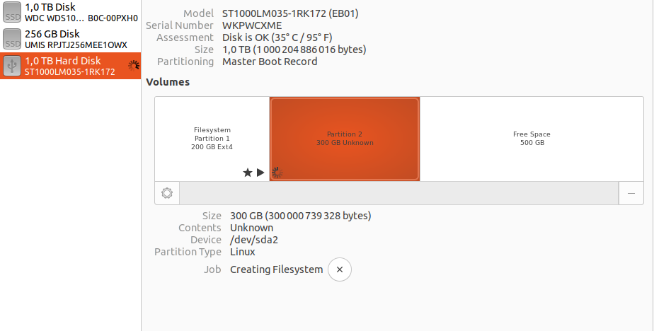
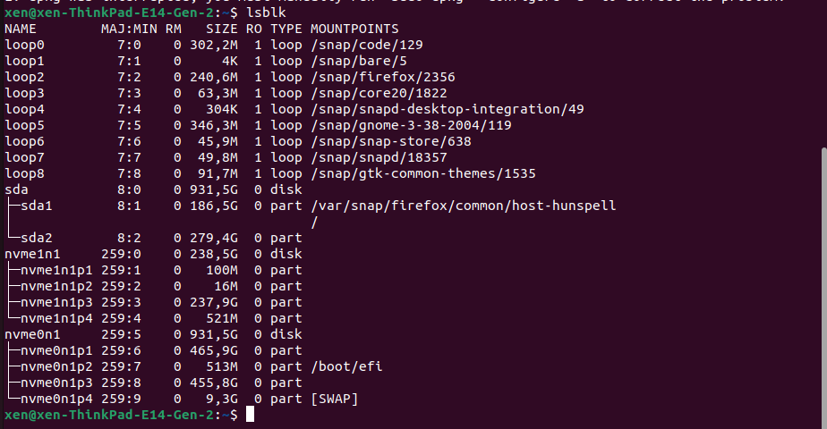
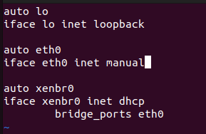

# Установка Xen
На данном этапе установлена система, которая будет ялятся нудевым доменом.
Рядом с ней есть свободное место

    sudo apt-get install xen-system-amd64

После перезагрузки можно будет зайти на эту же систему под рутом xen

Чтобы посмотреть информацию о гипервизоре надо ввести

    xl dmesg

Убедимся в поддержке виртуализации:

Чтобы работать с памятью необходимо установить LVM

    sudo apt-get install lvm2
    
 Не надо трогать диск во время работы с ним, а то будет вот это:

Чтобы посмотреть информацию о дисках нужно ввести:
	
	lsblk	
	

Рядом с линуксом было свободное место без системы. Чтобы добавить туда систему на которую будут устанавливаться домены воспользуемся приложением disk:

Теперь естьсистема на /dev/sda2

Воспользуемся ранее установленной тулой для работы с виртуальными дисками(volume groups):

	sudo pvcreate /dev/sda2
	sudo vgcreate vg0 /dev/sda2

## Создание виртуального свича
Чтобы виртуальные машины могли иметь доступ к интернету необходимо сделать виртуальный роутер на соновной машине:

	sudo apt-get install bridge-utils
	
Далее необходимо отредактировать конфигурационный файл:

	sudo vim /etc/network/interfaces
	
Редактируем:

НАДО УСТАНОВИТЬ ifupdown

## Создание системы 
	sudo apt-get install xen-tools
	sudo xen-create-image --hostname=tutorial-pv-guest   --memory=512mb   --vcpus=2   --lvm=vg0   --dhcp   --pygrub   --dist=wheezy
	
	
# При запуске образа возникла проблема
Для ее исправления попробовал переписать файл граба

Чтобы сохранить конфигурации граба его надо установить:
	sudo update-grub
	
