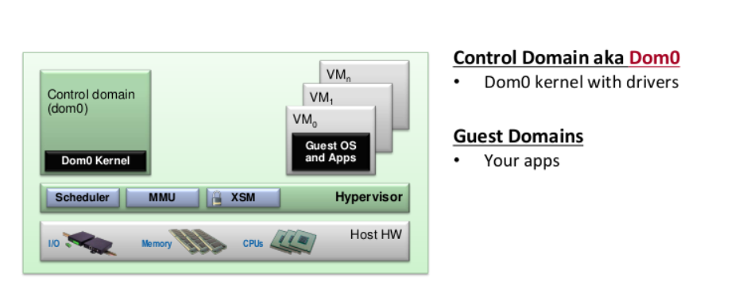
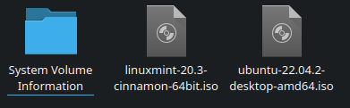
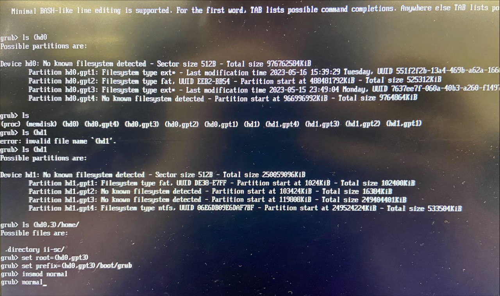
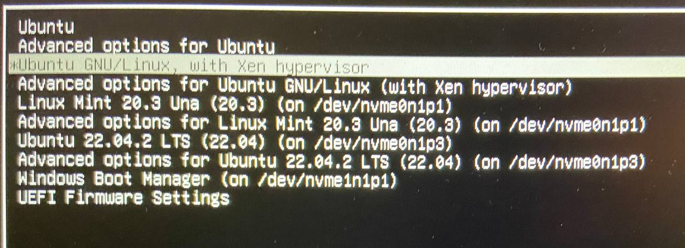
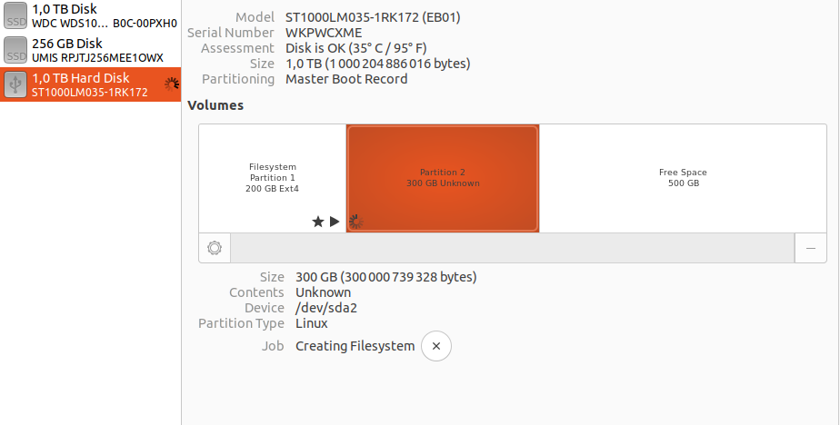
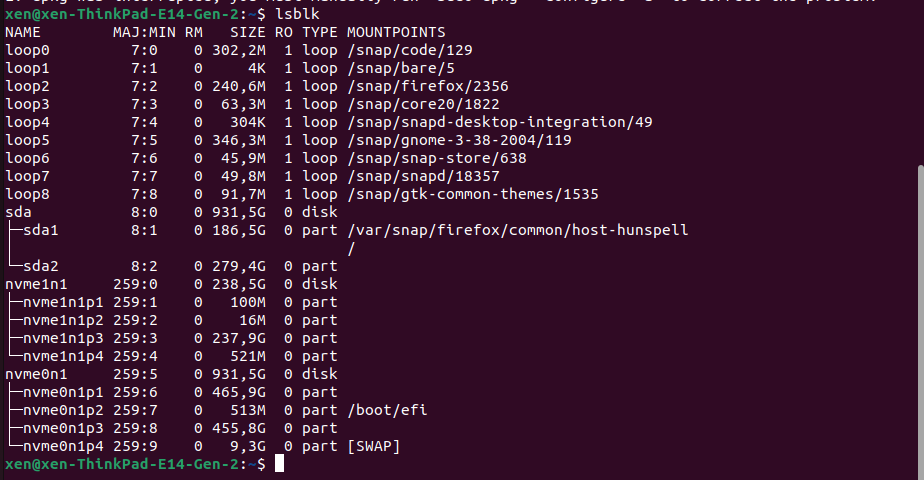
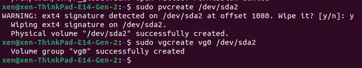
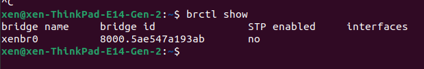
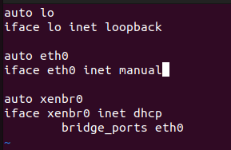
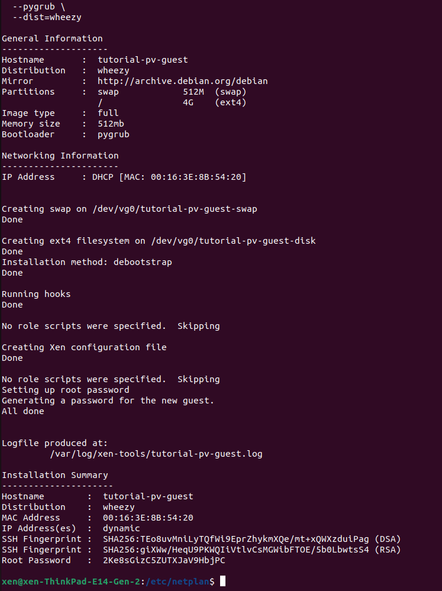

# Type 1 hypervisors

Выполнил: Шумаков Иван

## Введение в гипервизоры

В данной работе рассматривается процесс настройки гипервизора первого типа на локальном компьютере. 
С его помощью возможно администрировать `bare-metal` виртуальные машины, установленные на той же локальной машине. 

В качестве такого гипервизора было выбрано решение от `Xen project`.

Общая схема работы:

Администрирование всей системы проводится из dom0(в данной работе в качестве системы dom0 была выбрана Ubuntu 20)

В качестве виртуальных машин могут быть установлены как `paravirtualized guests`, так и `hardware virtualized guests`. Первые отличаются тем, что системы осведомлена о том, что работает на основе гипервизора. За счет этого достигается лучшая производительность по сравнению со вторым вариантом. Hardware virtualized guests - системы для которых полностью эмулируется железо компьютера. Таким образом система не отличается от обычной ОС, установленной напрямую.

## План установки

- создание системы для dom0
  - загрузочная флешка Ventoy
  - работа с grub
- настройка dom0
  - работа с LVM
  - создание виртуального switch
- создание гостевой системы

## Создание системы для dom0

Для работы гипервизора необходим линукс для управляющего домена и свободное место для остальных виртуальных машин. 

Основная система была установлены на внешний жесткий диск с помощью загрузочной флешки с программой `Ventoy`.

### Загрузочгая флешка Ventoy

`Ventoy` - программа, позволяющая создавать несколько загрузочных образов на одной флешке. Сами образы хранятся как отдельные файлыб что позволяет использовать их не только при загрузке(например при создании виртуальной машины может понадобится такой образ)

### Работа с grub

После устанвки Ubuntu на внешний HDD grub был настроен на запуск системы с помощью её файлов. Поэтому после извлечения жесткого диска вместо загрузки системы появлялась командная строка `grub`

Чтобы запустить старую систему необходимо найти ее среди разделов диска. Для этого нужно воспользоваться командой

    ls (hd0
    ls (hd1

Это отобразит содержимое физических дисков. В моем случае рабочая система находилась в `(hd0,gpt3)`. Для ее запуска необходимо ввести:

    set root=(hd0,gpt3)
    set prefix=(hd0,gpt3)/boot/grub
    insmod normal
    normal

Чтобы восстановить загрузку, необходимо в командной строке линукса ввести

    sudo update-grub

## Настройка dom0

На данном этапе установлена система, которая будет ялятся нудевым доменом, и рядом с ней есть свободное место для виртуальных машин.

Для устанвки xen необходимо ввети

    sudo apt-get install xen-system-amd64
  
После перезагрузки можно будет зайти на эту же систему под рутом xen

Чтобы посмотреть информацию о гипервизоре надо ввести

    xl dmesg

Убедимся в поддержке виртуализации:

### Работа с LVM

Для работы с дисковым пространством необходимо установить `LVM`.
Это приложение позволяет создавать и удалять тома без перезагрузки всей системы.
Это понадобится при добавлении гостевых виртуальных машин.
Установка LVM

    sudo apt-get install lvm2

LVM работает на основе физического раздела, поэтому на свободном месте необходимо создать файловую систему.
Для этого воспользуемся приложением disk:

Теперь есть файловая система /dev/sda2

Воспользуемся LVM для создания групп разделов(volume groups):

	sudo pvcreate /dev/sda2
	sudo vgcreate vg0 /dev/sda2

### Создание виртуального switch

Чтобы виртуальные машины могли иметь доступ к интернету необходимо сделать виртуальный роутер на соновной машине:

	sudo apt-get install bridge-utils

Также понадобится утилита для управления настройками сети `ifupdown`:

Далее необходимо отредактировать конфигурационный файл:

	sudo vim /etc/network/interfaces

## Создание гостевой системы
Для создания образа необходимо установить `xen-tools`:

    sudo apt-get install xen-tools

Далее можно создать создать систему аналогичную dom0, но с другими парметрами(в данном случае это будет Ubuntu, которая поддерживает паравиртуализацию)

    sudo xen-create-image --hostname=tutorial-pv-guest   --memory=512mb   --vcpus=2   --lvm=vg0   --dhcp   --pygrub   --dist=wheezy
  

Далее для запуска виртуальной машины необходимо ввести:

    xl create -c /etc/xen/tutorial-pv-guest.cfg

# Результаты

После данной установки я попытался запустить виртуальную машину с помощью команды `xl create -c /etc/xen/tutorial-pv-guest.cfg`. 
В результате высветилась ошибка связанная с виртуальным коммутатором.
После этого я немного подправил конфигурацию `netplan`, но это привело к тому, что Ubuntu отвечающая за dom0 перестала загружаться из-за ошибки конфигурации сети. Скорее всего netplan конфликтовал с другими настройками. 

Восстановление доступа к такой системе тема отдельного реферата.